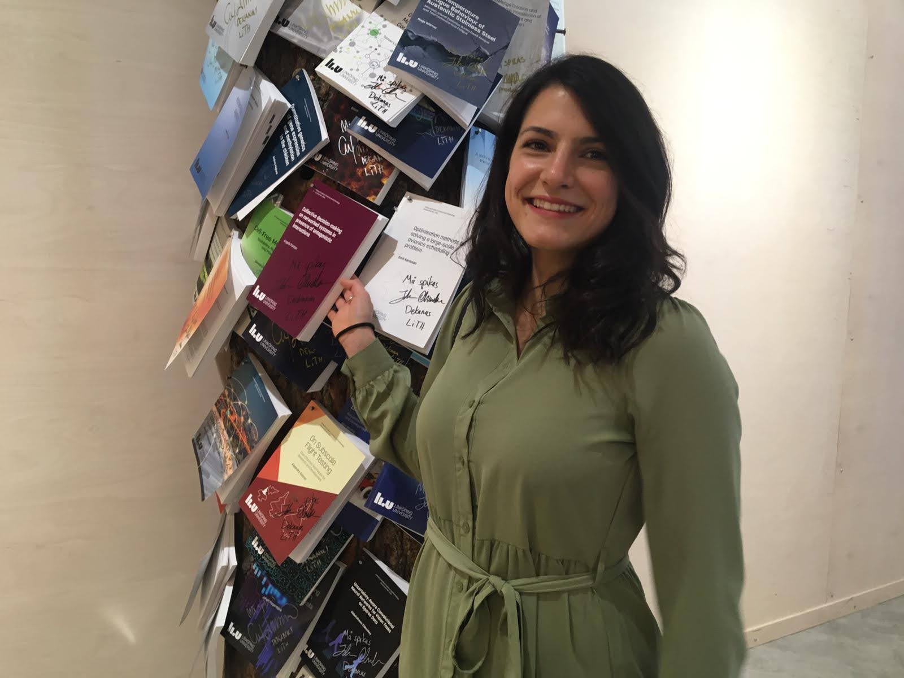
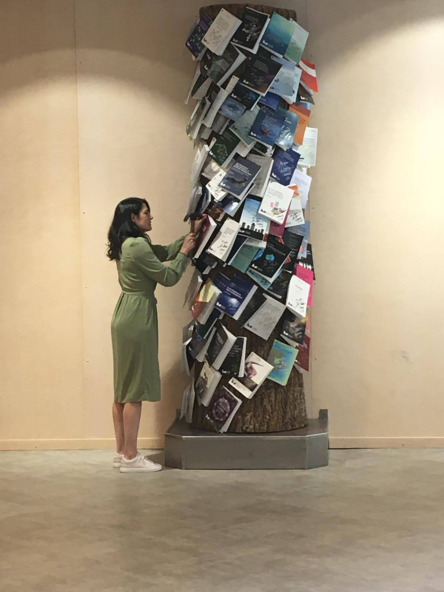

On September 3, 2021, I nailed my Ph.D. Thesis, and on September 24, 2021, I successfully defended my Ph.D. dissertation, entitled *Collective decision-making on networked systems in presence of antagonistic interactions*. 
[[DiVA]](http://liu.diva-portal.org/smash/record.jsf?pid=diva2%3A1585664&dswid=2165), [[Video]](https://www.youtube.com/watch?v=m6NPP-ZTM64)

 \
 
