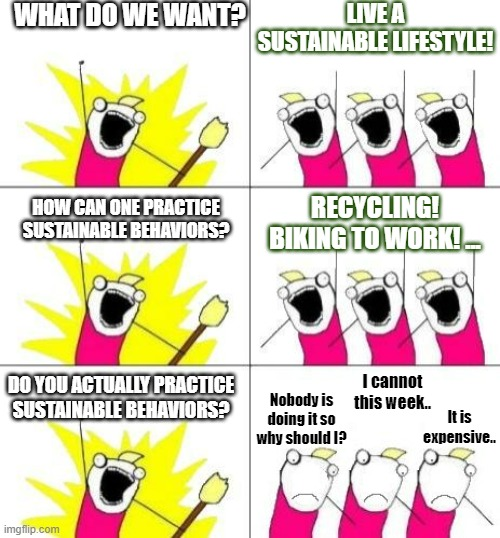

I have been invited to give a short talk about my research work at the [EECS Summer event](https://www.kth.se/eecs-summerevent-2022) on June 8, 2022, at KTH Main Campus.
To highlight the wide research footprint of EECS, the event presented a diverse [list of speakers](https://www.kth.se/eecs-summerevent-2022/standarddept/speakers-2022-1.1158933), one from each division. I am glad I was chosen to be part of such a fun and interactive event! :)

Title of my talk: *On behavioral changes for connected individuals: a networked dynamic decision-making approach*

