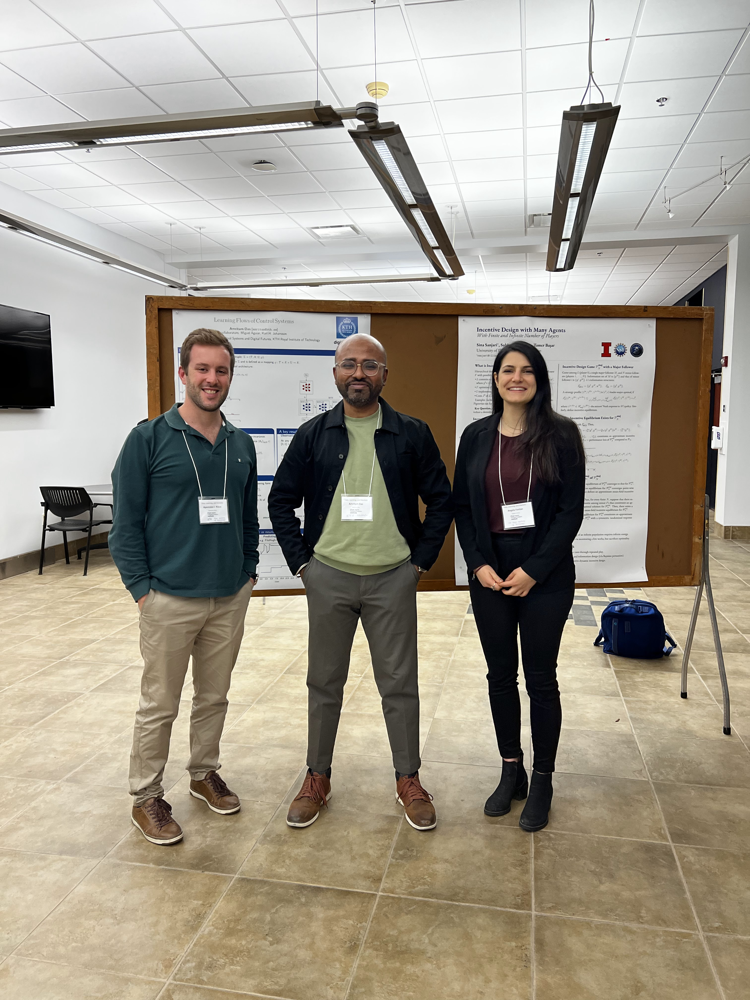

Together with Dr. [Amritam Das](http://amritamdas.com/) and Dr. [Apostolos Rikos](https://www.kth.se/profile/rikos?l=en), 
I am attending and presenting a poster at the [C3.ai DTI Workshop on Data, Learning, and Markets](https://c3dti.ai/events/workshops/data-learning-markets/), 
held at the University of Illinois at Urbana-Champaign, IL, USA. 
{: style="text-align: justify;"}

[Read Post](https://www.linkedin.com/posts/angelafontan_kth-digitalfutures-engineering-activity-6985988665680228355-HQMy?utm_source=share&utm_medium=member_desktop)

