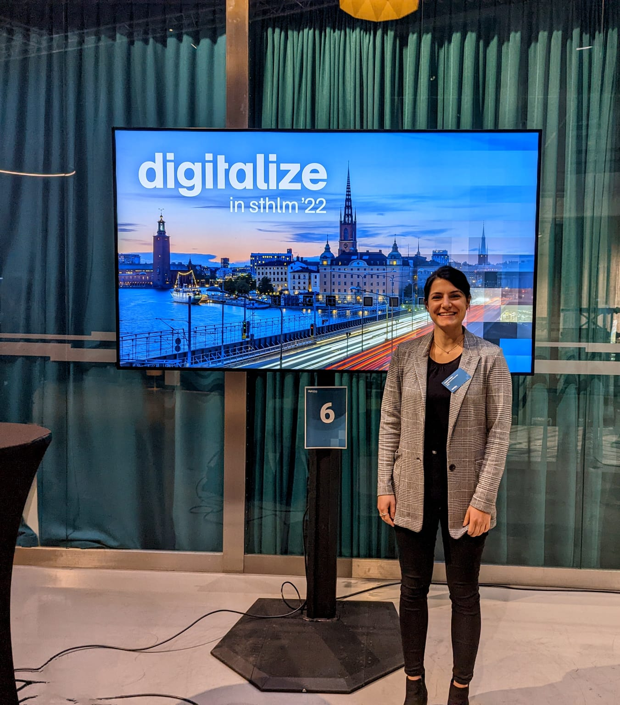

[Digitalize in Stockholm (DiS)](https://www.digitalfutures.kth.se/event/digitalize-in-stockholm-2022-day-1/) is an annual conference and meeting place for global 
thought leaders and rising stars in academia, industry, government, and civil society – all engaged in digital transformation. This year's event, [Digitalize in Stockholm 2022](https://digitalizeinsthlm22.se/), is a hybrid event, hosted by [Digital Futures](https://www.digitalfutures.kth.se/).

I am very excited to attend this event and, together with Prof. [Hedvig Kjellström](https://www.kth.se/profile/hedvig), present our case study in the [Humazing the Sustainable Smart City (HiSS) Project](https://sites.google.com/view/hiss-digitalfutures/home) 
during the [RESEARCH BREAK-OUT SESSION 2: Smart Society](https://digitalizeinsthlm22.se/program/) on October 19.
{: style="text-align: justify;"}

[Read Post on DiS by Anna Kiefer, the Chief Operating Officer at Digital Futures](https://www.linkedin.com/feed/update/urn:li:activity:6984187532972314624?updateEntityUrn=urn%3Ali%3Afs_feedUpdate%3A%28V2%2Curn%3Ali%3Aactivity%3A6984187532972314624%29)

